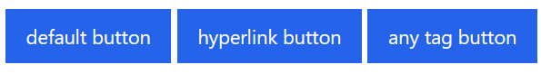
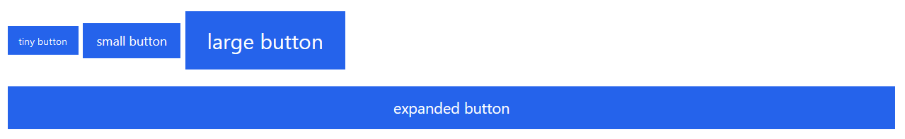
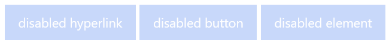
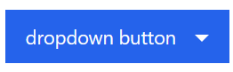
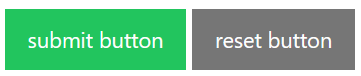
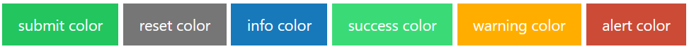
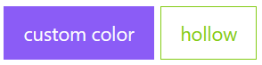
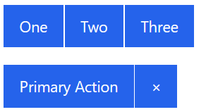
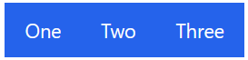

STA-TailwindCss/Buttons
================================================================================

Introduction
--------------------------------------------------------------------------------

These shiny button components made for [Tailwind CSS] are convenient 
tools when you need more traditional actions. Enjoy your care packet 
that has many easy to use button styles, which you can customize 
or override to fit your needs.

Checkout the demonstration site: https://sirthxalot.github.io/tailwindcss-buttons/

This plugin has been designed to be compatible with the Tailwind 
CSS framework (`^3.0`).

Installation
--------------------------------------------------------------------------------

### STEP-01: Install Dependencies

Install the dependencies via [NPM] or [Yarn] by executing the 
following command:

```bash
npm install -D @sta-tailwindcss/buttons
```

### STEP-02: Enable Tailwind CSS Plugin

Require the plugin (`@sta-tailwindcss/buttons`) within your 
Tailwind CSS configuration file (`tailwind.config.js`):

```js
// tailwind.config.js
module.exports = {
  theme: {
    // ...
  },
  plugins: [
    require('@sta-tailwindcss/buttons'),
    // ...
  ],
}
```

Getting Started
--------------------------------------------------------------------------------

### Basics

A basic button can be created with minimal markup - all you need 
to do is to add the `.button` CSS class to turn anything into a 
button. Because buttons can be used for many purposes, it's 
important to use the right tag.



```html
<button class="button" type="button">default button</button>
<a class="button" href="#an-anchor" role="button">hyperlink button</a>
<span class="button" role="button">any tag button</span>
```

### Sizing

Additional classes can be added to your button to change its size 
and shape.



```html
<button class="button tiny" type="button">tiny button</button>
<button class="button small" type="button">small button</button>
<button class="button large" type="button">large button</button>
<button class="button expanded" type="button">expanded button</button>
```

### Disabled Buttons

The `.disabled` CSS class will give buttons a faded appearance. 
The class is a purely visual style, and won't actually disable 
a control. For `<button>` elements, you can add the `disabled` 
attribute to both disable and style it. If you want to disable a 
link, you should add the `aria-disabled` attribute to mark it as 
disabled for assistive technology.



```html
<a class="button" href="#" aria-disabled>disabled hyperlink</a>
<button class="button" type="button" disabled>disabled button</button>
<span class="button disabled">disabled element</span>
```

### Dropdown Arrow

Add a dropdown arrow CSS icon to your button with the 
`.dropdown` class.



```html
<button class="button dropdown">dropdown button</button>
```

### Button Types

Buttons which uses the `submit` or `reset` type attribute have 
their own predefined color.



```html
<button class="button" type="submit">submit button</button>
<button class="button" type="reset">reset button</button>
```

### Coloring

Add color classes to give buttons additional meaning:



```html
<button class="button submit">submit color</button>
<button class="button reset">reset color</button>
<button class="button info">info color</button>
<button class="button success">success color</button>
<button class="button warning">warning color</button>
<button class="button alert">alert color</button>
```

Or overwrite the colors with your own flavor:



```html
<button class="button bg-violet-500 active:bg-violet-700 focus:!bg-violet-700 hover:!bg-violet-700">custom color</button>
<button class="button bg-white active:bg-white focus:!bg-white hover:!bg-white text-lime-500 active:text-lime-700 focus:!text-lime-700 hover:!text-lime-700 border-lime-500 active:border-lime-700 focus:border-lime-700 hover:border-lime-700">hollow</button>
```

> **Note**  
> Buttons are using background, border and text colors. They are 
> also using different colors for the `:active`, `:focus` and `:hover` 
> state.

### Button Group

Button groups are containers for related action items. They're 
great when you need to display a group of actions in a bar. 

Add the `.button-group` class to a container, and inside it place 
any number of buttons. The buttons are separated by a small border.



```html
<div class="button-group">
    <a class="button">One</a>
    <a class="button">Two</a>
    <a class="button">Three</a>
</div>
```

Button groups can be sized with the same classes as standard buttons: 
`.tiny`, `.small`, and `.large`.

```html
<div class="tiny button-group">
    <a class="button">One</a>
    <a class="button">Two</a>
    <a class="button">Three</a>
</div>
```

When using a single color for the button-group, you might want to 
remove the `1px` spacing between the buttons. You can use `.no-gaps` 
to just the same.



```html
<div class="no-gaps button-group">
    <a class="button">One</a>
    <a class="button">Two</a>
    <a class="button">Three</a>
</div>
```

Add the `.expanded` class to the container to make a full-width 
button group. Each item will automatically size itself based on 
how many buttons there are, up to a maximum of six.


```html
<div class="expanded button-group">
    <a class="button">Expanded</a>
    <a class="button">Button</a>
    <a class="button">Group</a>
</div>
```

Configuration
--------------------------------------------------------------------------------

There are plenty of ways how you can customize your buttons. One 
simple but global change can be done within the theme configuration.

### Font Setup

**Key** | **Description**                          | **Default Value**
:------ |:-----------------------------------------| :--------------
`theme.button.font.family` | Default font family used within buttons. | `inherit`
`theme.button.font.lineHeight` | Default line height used within buttons. | `1`
`theme.button.font.size.base` | Default font size used within buttons.   | `0.9rem`
`theme.button.font.size.tiny` | Tiny font size used within buttons.      | `0.6rem`
`theme.button.font.size.small` | Small font size used within buttons.     | `0.75rem`
`theme.button.font.size.large` | Large font size used within buttons.     | `1.25rem`

### Border Setup

**Key** | **Description**                          | **Default Value**
:------ |:-----------------------------------------| :--------------
`theme.button.border.radius` | Default border radius for buttons. | `0`
`theme.button.border.style` | Default border style for buttons. | `solid`
`theme.button.border.width` | Default border width for buttons. | `1px`


### Size Setup

**Key** | **Description**                   | **Default Value**
:------ |:----------------------------------| :--------------
`theme.button.size.margin` | Default margin used for buttons.  | `0 0 1rem 0`
`theme.button.size.padding` | Default padding used for buttons. | `0.85em 1em`

### Disabled Buttons Setup

**Key** | **Description**                    | **Default Value**
:------ |:-----------------------------------| :--------------
`theme.button.disabled.opacity` | Opacity used for disabled buttons. | `0.25`
`theme.button.disabled.cursor` | Cursor used for disabled buttons.  | `not-allowed`

### Alert Color Setup

**Key** | **Description**                                  | **Default Value**
:------ |:-------------------------------------------------| :--------------
`theme.button.colors.alert.background.base` | Background color used for alert buttons.         | `#cc4b37`
`theme.button.colors.alert.background.active` | Background color used for active alert buttons.  | `#a53b2a`
`theme.button.colors.alert.background.focus` | Background color used for focused alert buttons. | `#a53b2a`
`theme.button.colors.alert.background.hover` | Background color used for hovered alert buttons. | `#a53b2a`
`theme.button.colors.alert.color.base` | Text color used for alert buttons.               | `#fefefe`
`theme.button.colors.alert.color.active` | Text color used for active alert buttons.        | `#fefefe`
`theme.button.colors.alert.color.focus` | Text color used for focused alert buttons.       | `#fefefe`
`theme.button.colors.alert.color.hover` | Text color used for hovered alert buttons.       | `#fefefe`

### Base Color Setup

**Key** | **Description**                                 | **Default Value**
:------ |:------------------------------------------------| :--------------
`theme.button.colors.base.background.base` | Background color used for base buttons.         | `#2563EB`
`theme.button.colors.base.background.active` | Background color used for active base buttons.  | `#1E40AF`
`theme.button.colors.base.background.focus` | Background color used for focused base buttons. | `#1E40AF`
`theme.button.colors.base.background.hover` | Background color used for hovered base buttons. | `#1E40AF`
`theme.button.colors.base.border` | Border color used for base buttons.             | `transparent`
`theme.button.colors.base.color.base` | Text color used for base buttons.               | `#fefefe`
`theme.button.colors.base.color.active` | Text color used for active base buttons.        | `#fefefe`
`theme.button.colors.base.color.focus` | Text color used for focused base buttons.       | `#fefefe`
`theme.button.colors.base.color.hover` | Text color used for hovered base buttons.       | `#fefefe`

### Info Color Setup

**Key** | **Description**                                 | **Default Value**
:------ |:------------------------------------------------| :--------------
`theme.button.colors.info.background.base` | Background color used for info buttons.         | `#1779ba`
`theme.button.colors.info.background.active` | Background color used for active info buttons.  | `#126195`
`theme.button.colors.info.background.focus` | Background color used for focused info buttons. | `#126195`
`theme.button.colors.info.background.hover` | Background color used for hovered info buttons. | `#126195`
`theme.button.colors.info.color.base` | Text color used for info buttons.               | `#fefefe`
`theme.button.colors.info.color.active` | Text color used for active info buttons.        | `#fefefe`
`theme.button.colors.info.color.focus` | Text color used for focused info buttons.       | `#fefefe`
`theme.button.colors.info.color.hover` | Text color used for hovered info buttons.       | `#fefefe`

### Reset Color Setup

**Key** | **Description**                                  | **Default Value**
:------ |:-------------------------------------------------| :--------------
`theme.button.colors.reset.background.base` | Background color used for reset buttons.         | `#767676`
`theme.button.colors.reset.background.active` | Background color used for active reset buttons.  | `#0a0a0a`
`theme.button.colors.reset.background.focus` | Background color used for focused reset buttons. | `#0a0a0a`
`theme.button.colors.reset.background.hover` | Background color used for hovered reset buttons. | `#0a0a0a`
`theme.button.colors.reset.color.base` | Text color used for reset buttons.               | `#fefefe`
`theme.button.colors.reset.color.active` | Text color used for active reset buttons.        | `#fefefe`
`theme.button.colors.reset.color.focus` | Text color used for focused reset buttons.       | `#fefefe`
`theme.button.colors.reset.color.hover` | Text color used for hovered reset buttons.       | `#fefefe`

### Submit Color Setup

**Key** | **Description**                                   | **Default Value**
:------ |:--------------------------------------------------| :--------------
`theme.button.colors.submit.background.base` | Background color used for submit buttons.         | `#22c55e`
`theme.button.colors.submit.background.active` | Background color used for active submit buttons.  | `#15803d`
`theme.button.colors.submit.background.focus` | Background color used for focused submit buttons. | `#15803d`
`theme.button.colors.submit.background.hover` | Background color used for hovered submit buttons. | `#15803d`
`theme.button.colors.submit.color.base` | Text color used for submit buttons.               | `#fefefe`
`theme.button.colors.submit.color.active` | Text color used for active submit buttons.        | `#fefefe`
`theme.button.colors.submit.color.focus` | Text color used for focused submit buttons.       | `#fefefe`
`theme.button.colors.submit.color.hover` | Text color used for hovered submit buttons.       | `#fefefe`

### Success Color Setup

**Key** | **Description**                                    | **Default Value**
:------ |:---------------------------------------------------| :--------------
`theme.button.colors.success.background.base` | Background color used for success buttons.         | `#3adb76`
`theme.button.colors.success.background.active` | Background color used for active success buttons.  | `#22bb5b`
`theme.button.colors.success.background.focus` | Background color used for focused success buttons. | `#22bb5b`
`theme.button.colors.success.background.hover` | Background color used for hovered success buttons. | `#22bb5b`
`theme.button.colors.success.color.base` | Text color used for success buttons.               | `#fefefe`
`theme.button.colors.success.color.active` | Text color used for active success buttons.        | `#fefefe`
`theme.button.colors.success.color.focus` | Text color used for focused success buttons.       | `#fefefe`
`theme.button.colors.success.color.hover` | Text color used for hovered success buttons.       | `#fefefe`

### Warning Color Setup

**Key** | **Description**                                    | **Default Value**
:------ |:---------------------------------------------------| :--------------
`theme.button.colors.warning.background.base` | Background color used for warning buttons.         | `#ffae00`
`theme.button.colors.warning.background.active` | Background color used for active warning buttons.  | `#cc8b00`
`theme.button.colors.warning.background.focus` | Background color used for focused warning buttons. | `#cc8b00`
`theme.button.colors.warning.background.hover` | Background color used for hovered warning buttons. | `#cc8b00`
`theme.button.colors.warning.color.base` | Text color used for warning buttons.               | `#fefefe`
`theme.button.colors.warning.color.active` | Text color used for active warning buttons.        | `#fefefe`
`theme.button.colors.warning.color.focus` | Text color used for focused warning buttons.       | `#fefefe`
`theme.button.colors.warning.color.hover` | Text color used for hovered warning buttons.       | `#fefefe`

Browser Support
--------------------------------------------------------------------------------

We support the latest, stable releases of all major browsers.

 |  |  |  |  
--- |--------------------------------------------------------------------------------------------------------|---------------------------------------------------------------------------------------------|--------------------------------------------------------------------------------------------------|----------------------------------------------------------------------------------------------------|
21+ ✔ | 20+ ✔                                                                                                  | 12+ ✔                                                                                       | 15+ ✔                                                                                            | 9+ ✔                                                                                               |

> **Note**  
> The components has been tested within Google Chrome (v108.0.5359.99) 
> 64-Bit version on Windows.

License
--------------------------------------------------------------------------------

This open-sourced software is licensed under the [MIT license].

<!--                            that's all folks!                            -->

[NPM]: https://www.npmjs.com/
[yarn]: https://yarnpkg.com/
[Tailwind CSS]: https://tailwindcss.com/
[MIT license]: ./LICENSE.md
